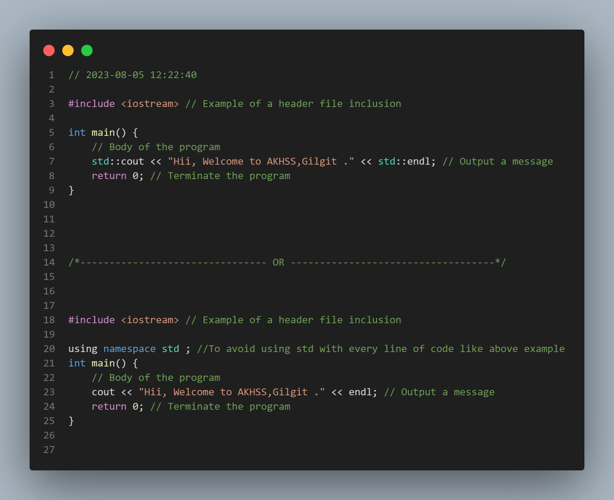
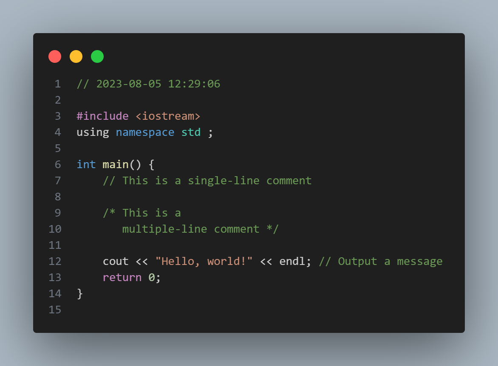

## Definitions

Program: A program is a set of instructions that a computer follows to perform a specific task. It is written in a programming language and consists of a series of commands that dictate the flow of actions to be taken by the computer.

Programming Language: A programming language is a formal system used for instructing a computer. It consists of a set of rules, syntax, and semantics that allow programmers to write code that the computer can understand and execute.

Header Files: Header files in C++ are files that contain declarations for functions, classes, and other constructs. They provide essential information to the compiler about the various components used in the program. Header files are included in C++ programs using the #include pre-processor directive.

Reserved Words: Reserved words, also known as keywords, are words in a programming language that have a predefined meaning and cannot be used for other purposes, such as variable names or function names. These words are reserved for specific programming tasks. In C++, examples of reserved words include int, if, else, while, etc.

## Comments
Comments are used to provide explanations or annotations within the code. They are ignored by the compiler and are meant for programmers' understanding. In C++, there are single-line comments ('//') and multiple-line comments ('/* ... */').

## Code Snippet - Basic Code Structure

## Code Snippet - Comments

