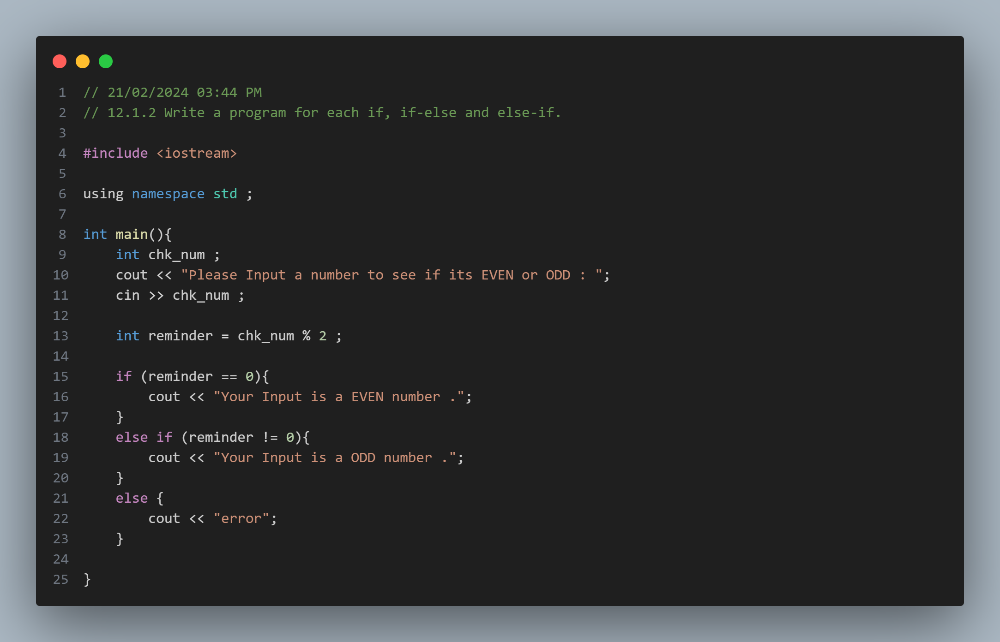
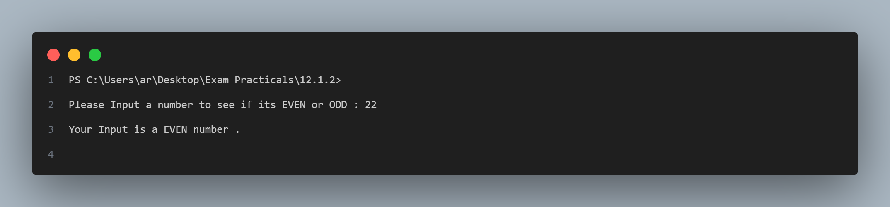

# Practical No. 1: Introduction to Conditional Statements

## Objective:
The objective of this practical is to understand the basic usage of conditional statements such as `if`, `if-else`, and `else-if` in C++.

## Program Description:
In this program, we prompt the user to input a number and determine whether it is even or odd using conditional statements.

### Code:

### Output:

## How to Use:
1. Compile the provided code using a C++ compiler.
2. Run the executable file.
3. Input a number when prompted.
4. The program will display whether the input number is even or odd.

Feel free to utilize this README template for your subsequent practicals as well, updating the program description and screenshots accordingly.

