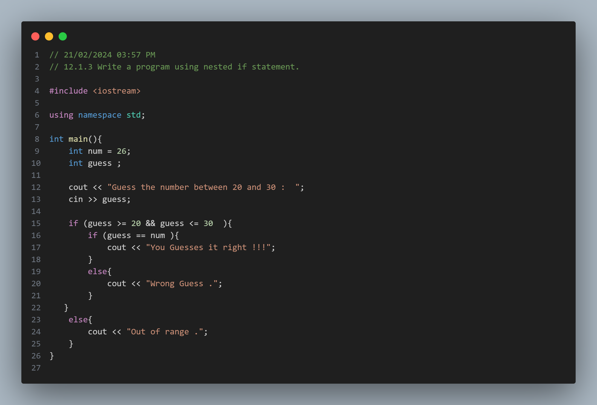
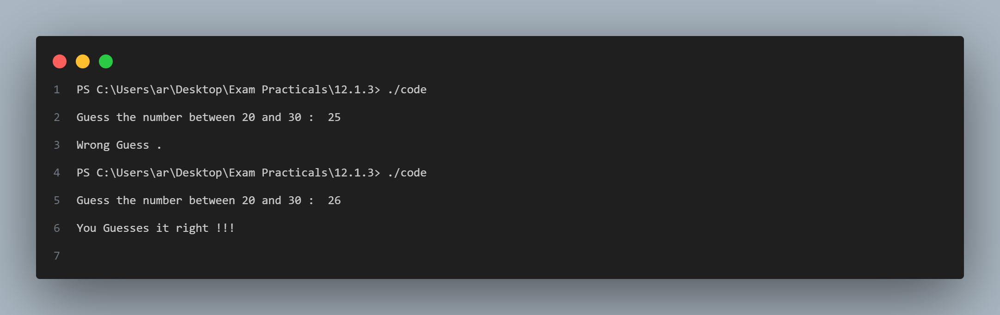

# Practical No. 2: Nested If Statement

## Objective:
The objective of this practical is to understand the usage of nested `if` statements in C++.

## Program Description:
In this program, we ask the user to guess a number between 20 and 30. If the guessed number matches the predefined number (26 in this case), it displays a success message; otherwise, it displays a failure message.

### Code Snapshot:

### Output Snapshot:

## How to Use:
1. Compile the provided code using a C++ compiler.
2. Run the executable file.
3. Input a number between 20 and 30 when prompted.
4. The program will inform you whether your guess was correct or not.

