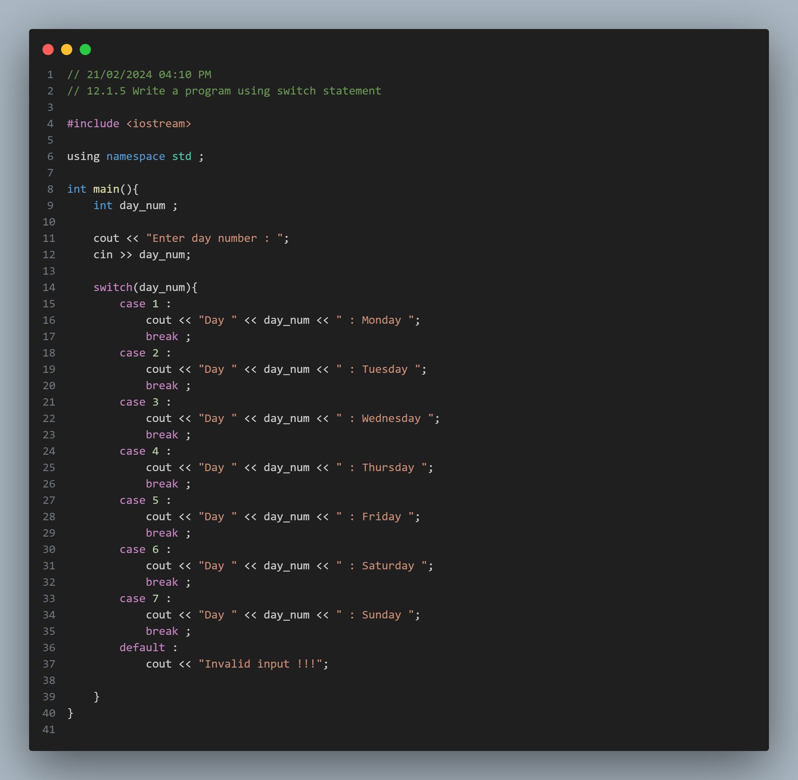
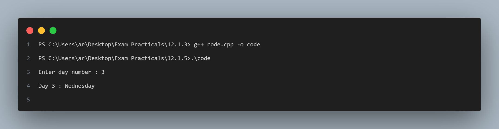

## Practical No. 3: Using Switch Statement

### Objective:
The objective of this practical is to understand the usage of the switch statement in C++.

### Program Description:
In this program, we prompt the user to enter a number representing a day of the week. The program then uses a switch statement to display the corresponding day.

### Code Snapshot:

### Output Snapshot:

### How to Use:
1. Compile the provided code using a C++ compiler.
2. Run the executable file.
3. Enter a number representing the day of the week when prompted.
4. The program will display the corresponding day.