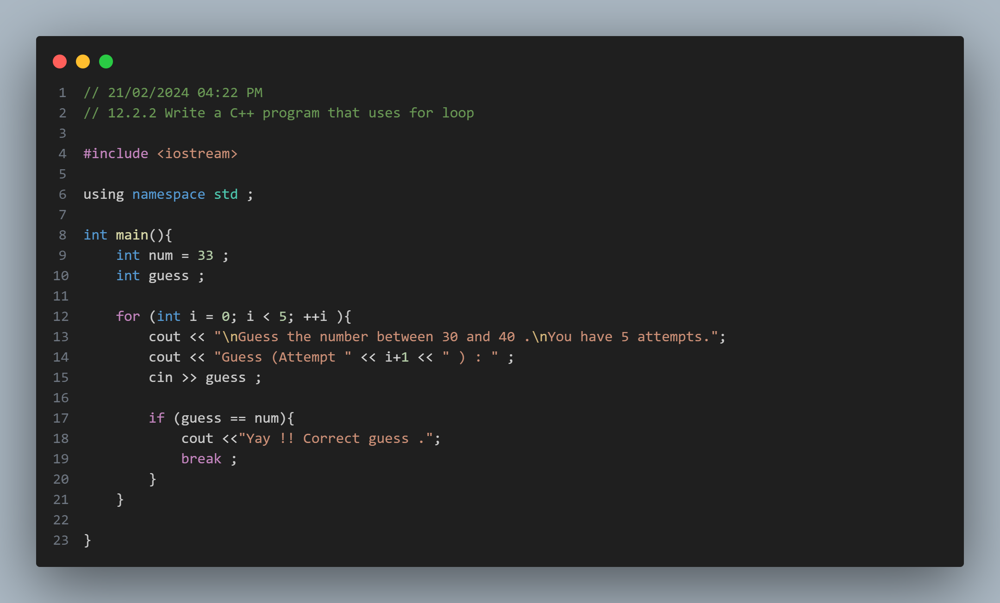
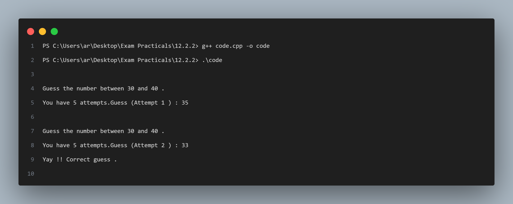

# Practical No. 4: Using For Loop

## Objective:
The objective of this practical is to understand the usage of the `for` loop in C++.

## Program Description:
In this program, we ask the user to guess a number between 30 and 40. The user has 5 attempts to guess the number. The program uses a `for` loop to iterate through each attempt and terminates if the correct guess is made.

### Code Snapshot:

### Output Snapshot:

## How to Use:
1. Compile the provided code using a C++ compiler.
2. Run the executable file.
3. Follow the instructions to guess a number between 30 and 40.
4. You have 5 attempts to guess the number.
5. If your guess is correct, the program will display a success message; otherwise, it will end after 5 attempts.

