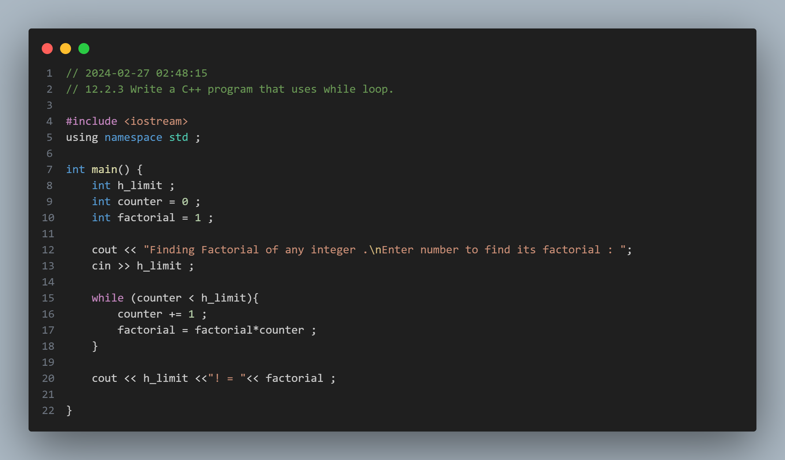
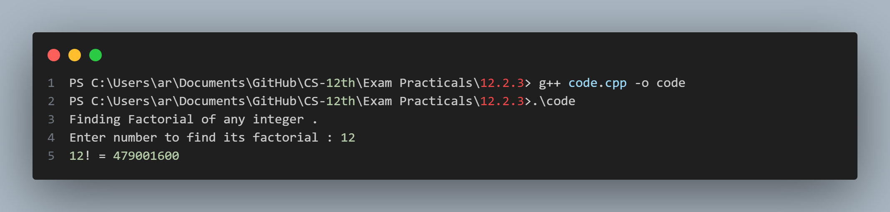

## Practical No. 5 - 12.2.3 Write a C++ program that uses while loop.

### Objective:
The objective of this practical is to understand the usage of the `while` loop in C++.

### Program Description:
In this program, we help the user to find factorial of any integer .

### Code Snapshot:

### Output Snapshot:

### How to Use:
1. Compile the provided code using a C++ compiler.
2. Run the executable file.
3. Follow the instructions to guess a number between 30 and 40.

