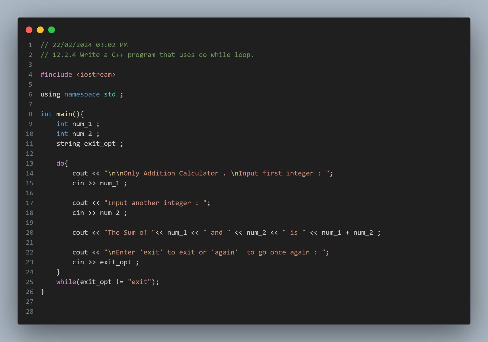
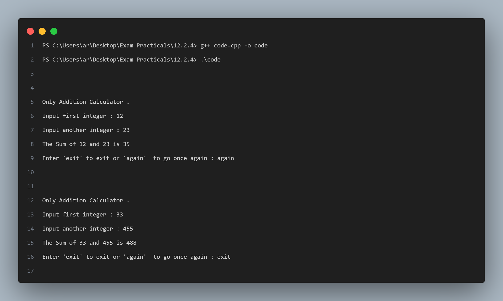

## Practical No. 5 - 12.2.4 - Write a C++ program that uses do while loop.

### Objective:
The objective of this practical is to understand the usage of the `do-while` loop in C++.

### Program Description:
In this program, the user adds two two integers for an infinite times unless he wants to exit , in which case he has to type "exit" to exit the program . The program uses a `do-while` loop to iterate through a piece of code atleast once .

### Code Snapshot:

### Output Snapshot:

### How to Use:
1. Compile the provided code using a C++ compiler.
2. Run the executable file.
3. Follow the instructions to add the input and add numbers .
4. Type `exit` after getting the sum to exit program or `again` to go once again.
