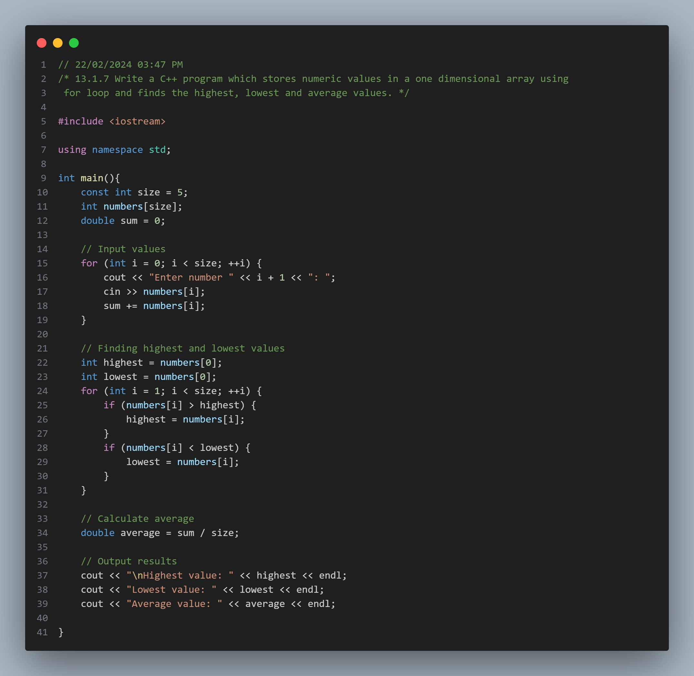
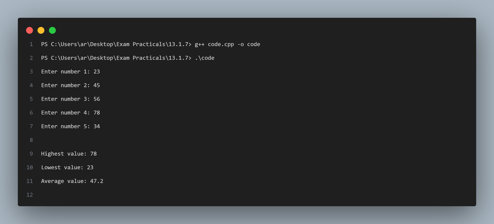

## Practical No. 7 - 13.1.7 Write a C++ program which stores numeric values in a one dimensional array using for loop and finds the highest, lowest and average values.

### Objective:
The objective of this practical is to understand the usage of the `one-dimensional arrays` in C++.
This includes declaring one-dimensional arrays , adding elements to the arrays and working with those elements .

### Program Description:
In this program, we ask the user to add a constant number of elements to the array (No. of elements can be changed by changing the value of `const int size = 5` on line 10). The program uses a `for` loop to  take multiple inputs and go through the array elements to find highest , lowest and average .

### Code Snapshot:

### Output Snapshot:

### How to Use:
1. Compile the provided code using a C++ compiler.
2. Run the executable file.
3. Follow the instructions .