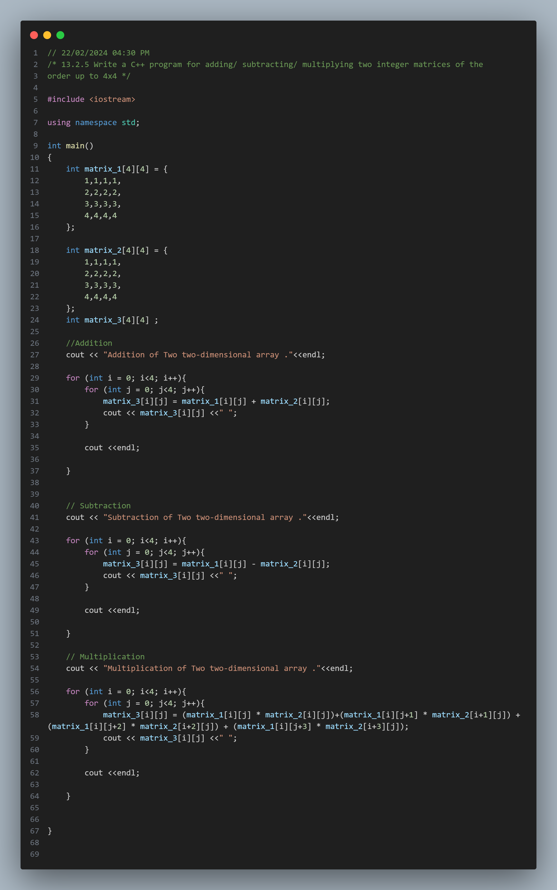
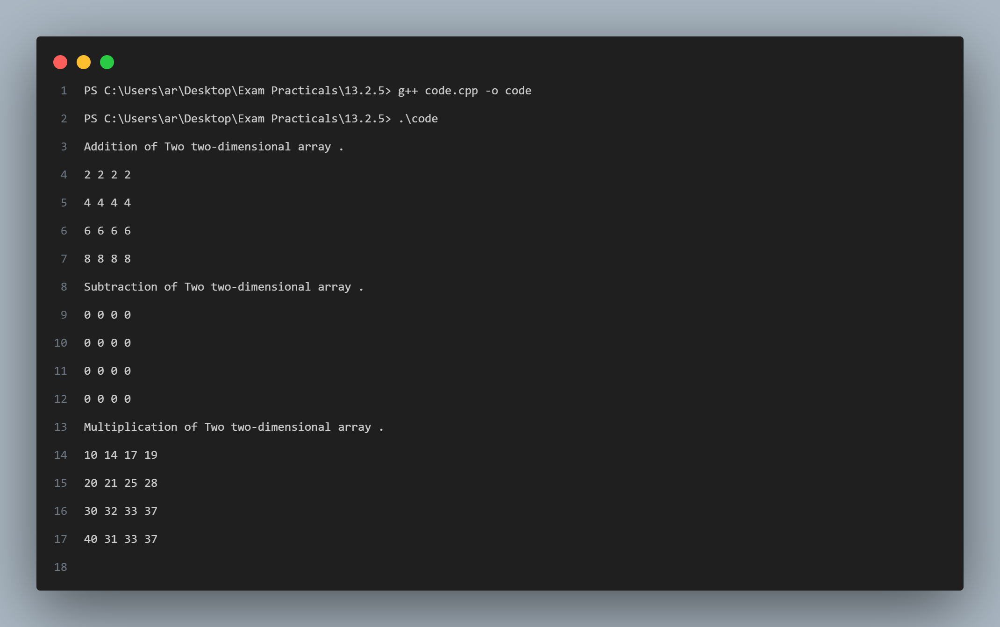

## Practical No. 8 - 13.2.5 Write a C++ program for adding/ subtracting/ multiplying two integer matrices of the order up to 4x4

### Objective:
The objective of this practical is to understand the usage of the `two-dimensional arrays` in C++.
This includes declaring declaring-dimensional arrays , adding elements to the arrays, accessing those values and working with those elements .

### Program Description:
In this program, we have declared two two-dimensional arrays ; `matrix_1` and `matrix_2` .as the requirement of the SLO we have proceeded with adding , subtracting and multiplication of those two matrices.We have simply added and subtracted the corrosponding elements of both matrices but for multiplication we have used the multiplication formula for matrices .

### Code Snapshot:

### Output Snapshot:

### How to Use:
1. Compile the provided code using a C++ compiler.
2. Run the executable file.
3. Follow the instructions .