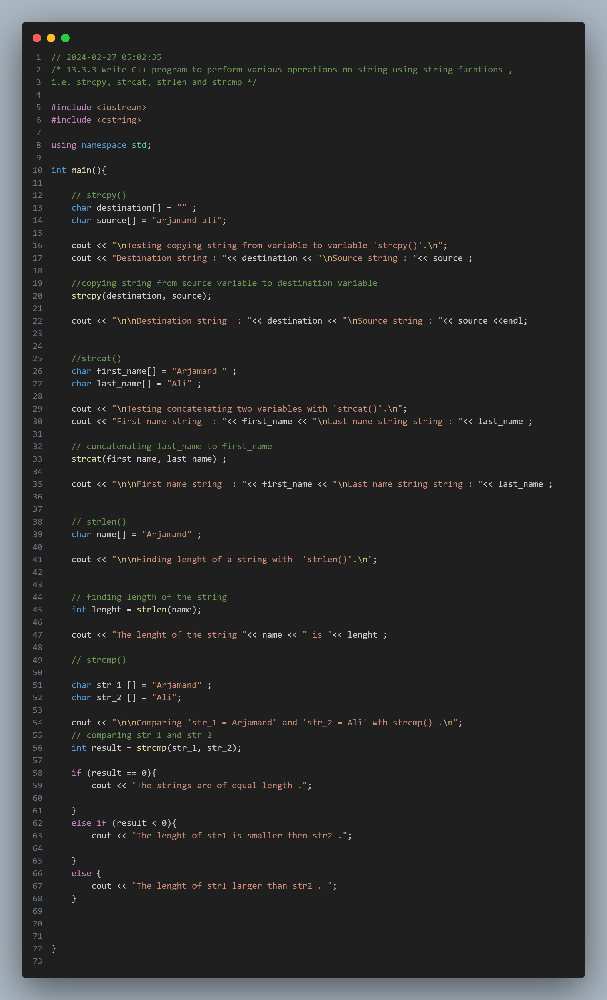
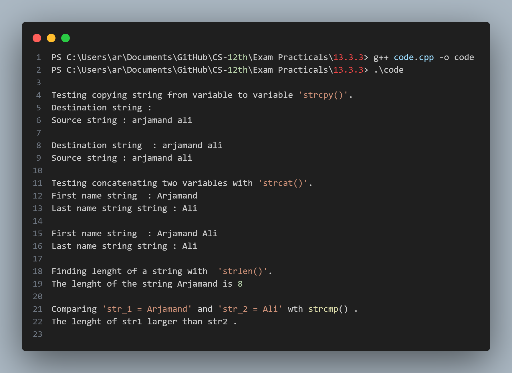

## Practical No. 9 - 13.3.3 - Write C++ program to perform various operations on string using string fucntions , i.e. strcpy, strcat, strlen and strcmp

### Objective:
The objective of this practical is to understand the usage of the various string functions in C++.
This includes perfoming different operations on string using string functions including ,strspy, strcmp, strcat, strlen .

### Code Snapshot:

### Output Snapshot:

### How to Use:
1. Compile the provided code using a C++ compiler.
2. Run the executable file.
3. Follow the instructions .