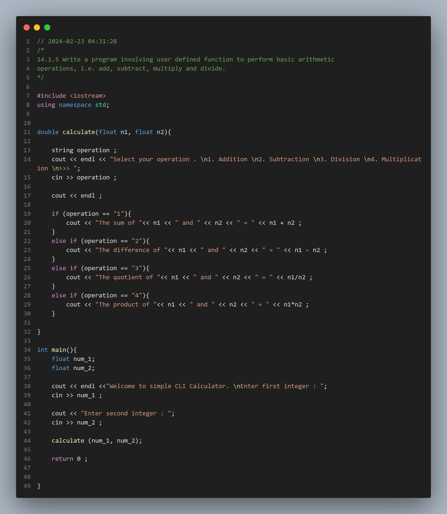
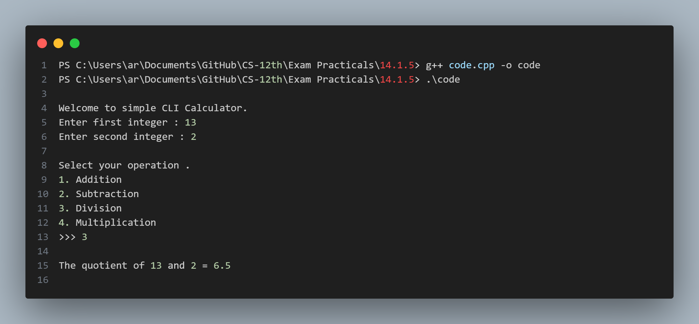

## Practical No. 9 - 14.1.5 - Write a program involving user defined function to perform basic arithmetic operations, i.e. add, subtract, multiply and divide.

### Objective:
The objective of this practical is to understand the usage of the `Funtions` in C++.
This includes declaring user defined functions , setting parameters , passing arguments and returning values .

### Program Description:
In this program, we ask user for two inputs which are stored in float variables , which are later passed to the `calculate()` function .The user is then offered with a menu of operations he can choose from and the selected operation will applied on the two previously taken values , alast returning the value .
### Code Snapshot:

### Output Snapshot:

### How to Use:
1. Compile the provided code using a C++ compiler.
2. Run the executable file.
3. Follow the instructions .