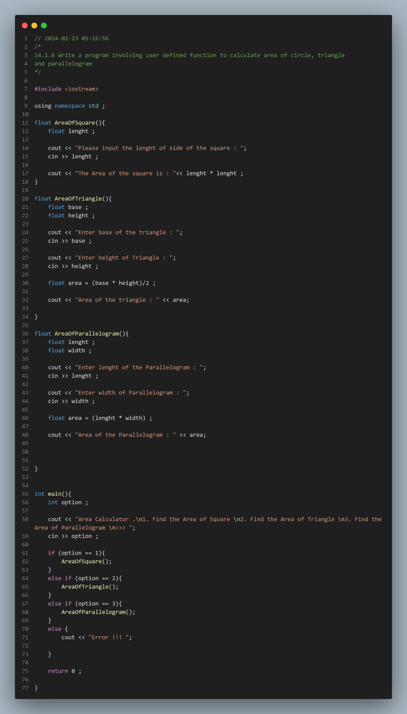
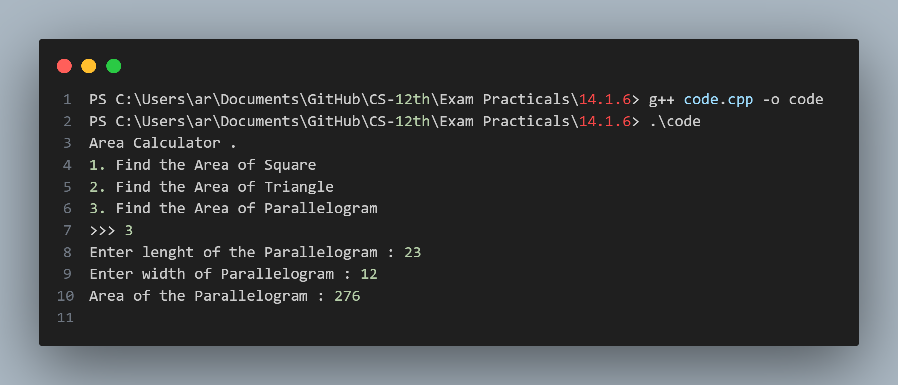

## Practical No. 10 - 14.1.6 - Write a program involving user defined function to calculate area of circle, triangle and parallelogram

### Objective:
The objective of this practical is to understand the usage of the `User Defined Funtions` in C++.
This includes declaring user defined functions and calling funtions.

### Program Description:
In this program the user is shown a menu of three option , upon selecting a certain option the programs runs the function specifically designed for that certain option . 
### Code Snapshot:

### Output Snapshot:

### How to Use:
1. Compile the provided code using a C++ compiler.
2. Run the executable file.
3. Follow the instructions .