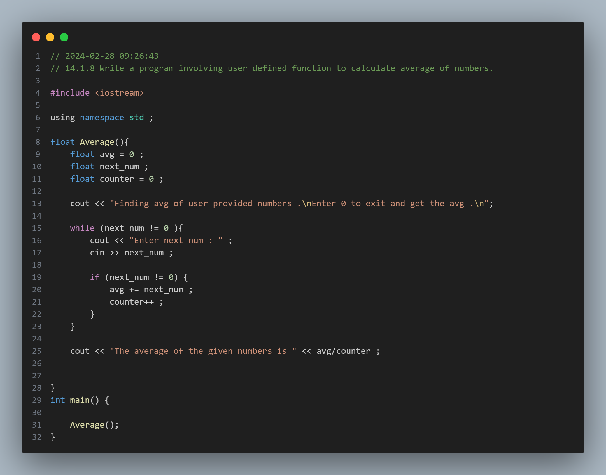
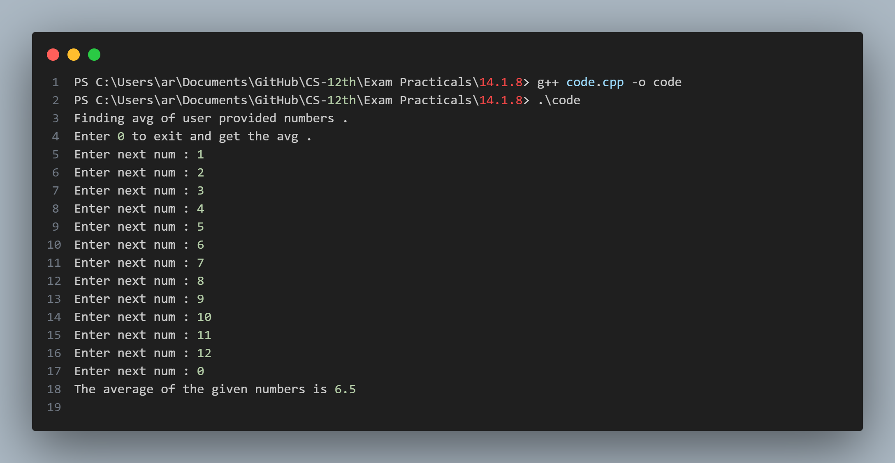

## Practical No. 14 - 14.1.8 Write a program involving user defined function to calculate average of numbers.
### Objective:
The objective of this practical is to understand the usage of the `User Defined Funtions` in C++.
This includes declaring user defined functions and calling funtions.

### Code Snapshot:

### Output Snapshot:

### How to Use:
1. Compile the provided code using a C++ compiler.
2. Run the executable file.
3. Follow the instructions .