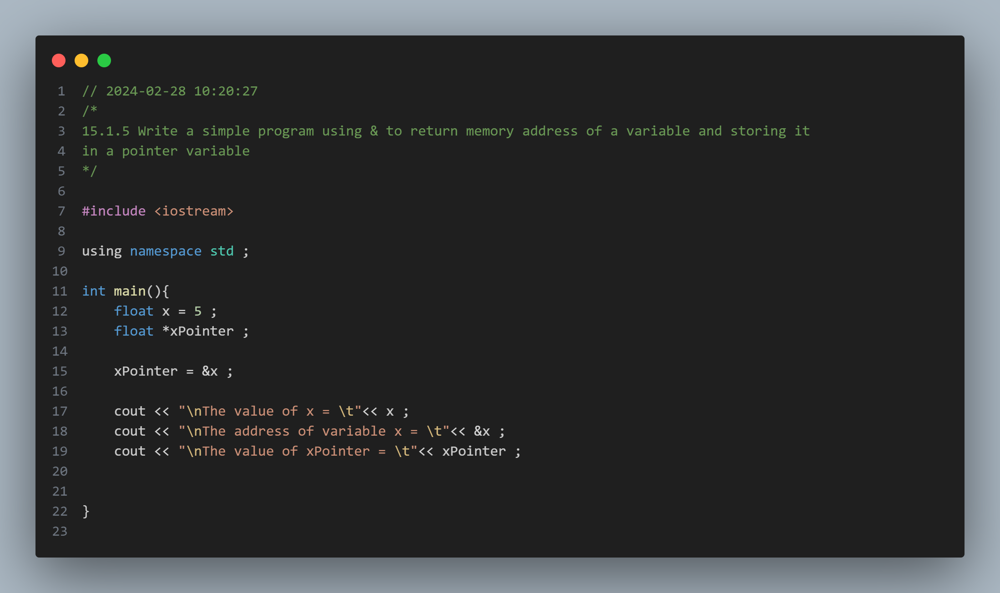
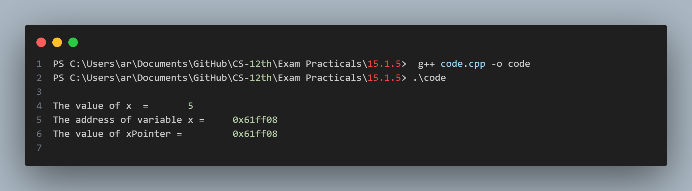

## Practical No. 15 - 15.1.5 - Write a simple program using & to return memory address of a variable and storing it in a pointer variable

### Objective:
The objective of this practical is to understand the usage of the pointers , reference `&` nad dereference `*` operators  in C++.

### Program Description:
The program assigns a value to normal operator `x` . The pointer variable `xPointer` is programed to hold the memory address of variable x .

### Code Snapshot:

### Output Snapshot:

### How to Use:
1. Compile the provided code using a C++ compiler.
2. Run the executable file.
