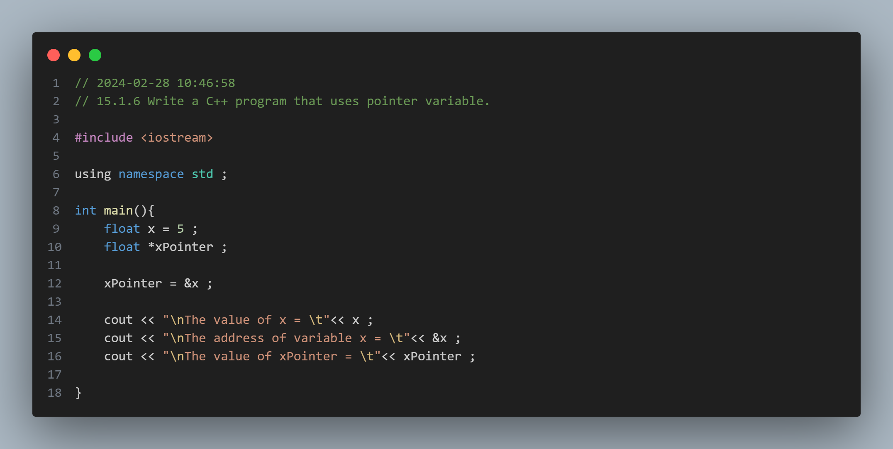
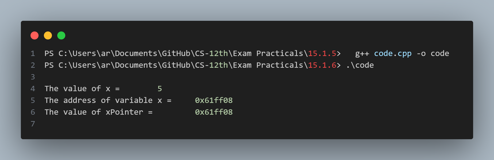

## Practical No. 16 - 15.1.6 Write a C++ program that uses pointer variable.

### Objective:
The objective of this practical is to understand the usage of the pointer variables.

### Program Description:
The program assigns a value to normal operator `x` . The pointer variable `xPointer` is programed to hold the memory address of variable x .

### Code Snapshot:

### Output Snapshot:

### How to Use:
1. Compile the provided code using a C++ compiler.
2. Run the executable file.
