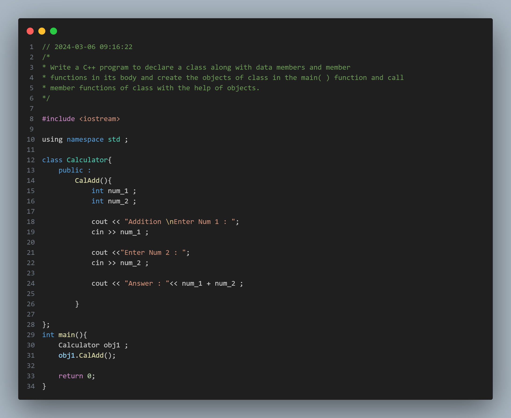
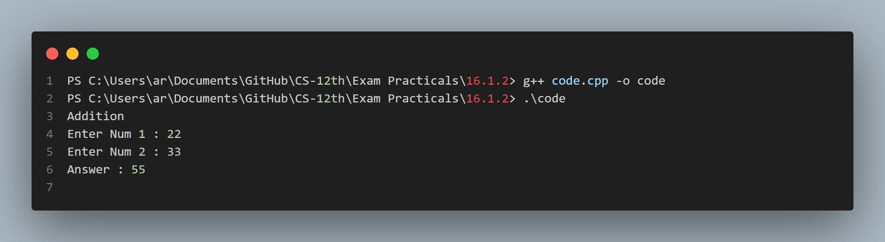

## Practical No. 17 - 16.1.2 - Write a C++ program to declare a class along with data members and member functions in its body and create the objects of class in the main( ) function and call member functions of class with the help of objects.

### Objective:
The objective of this practical is to understand the usage and concepts of Object Oriented Programming in CPP.

### Program Description:
The program declares a class `Calculator` and under the Public access specifier the program declares a member function `CalAdd` (AKA a method when the object is created ) . Alast the program creates an object `obj1` of class `Calculator` and then calls the member function `CalAdd` with the help of the newly created object .

### Code Snapshot:

### Output Snapshot:

### How to Use:
1. Compile the provided code using a C++ compiler.
2. Run the executable file.
