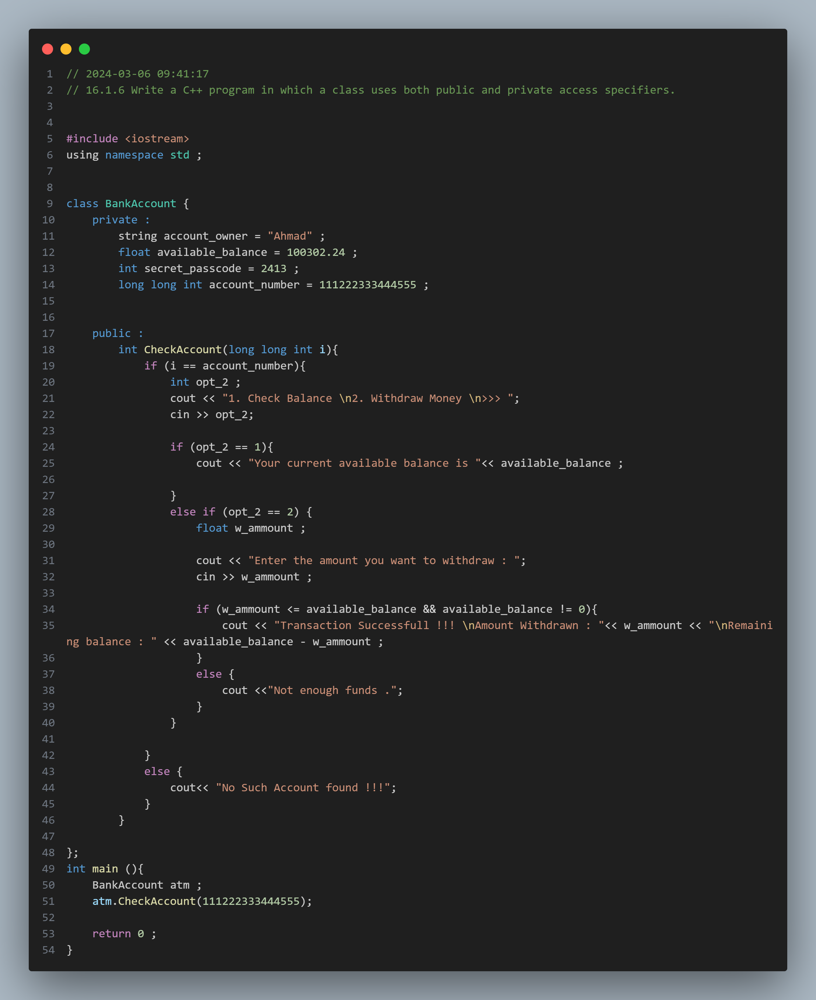
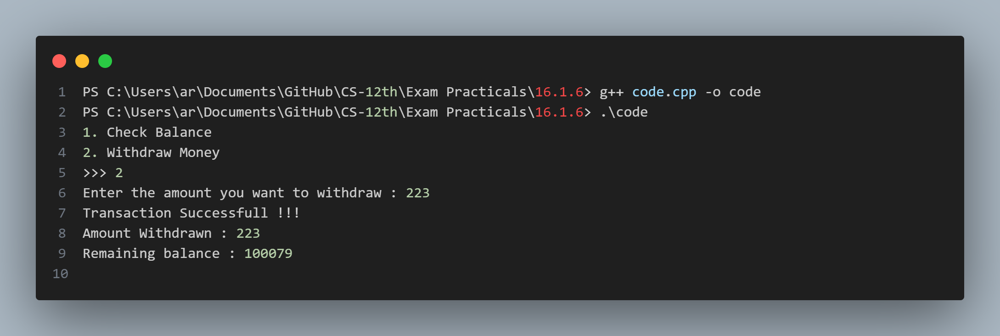

## Practical No. 18 - 16.1.6 - Write a C++ program in which a class uses both public and private access specifiers.

### Objective:
The objective of this practical is to understand the usage and concepts of Object Oriented Programming in CPP.

### Program Description:
The program declares a class `BankAccount` and inside the class , the program declares few details confidential information regarding the bank account under the `private` access specifier  which cannot be accessed by the program outside the class . Under `public` access specifier the progam declares `CheckAccount` function which can be accessed by code from anywhere in the program .

### Code Snapshot:

### Output Snapshot:

### How to Use:
1. Compile the provided code using a C++ compiler.
2. Run the executable file.
